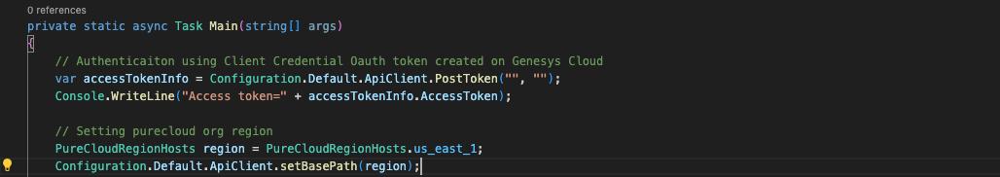
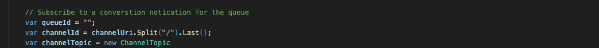

This project leverages the Genesys Platform API .NET Client SDK, a key component of Genesys Developer Tools, to demonstrate how to integrate OAuth Client Credential authentication for secure access.

In the first part, we utilize the Analytics API library to query voice conversation metrics, extracting insights such as:

- Number of connected interactions
- Number of transferred interactions
- Number of abandoned interactions

In the second part, we implement the Notifications API library to establish a WebSocket-based notification channel. This setup enables real-time queue observation query, allowing continuous monitoring of key interaction metrics such as:

- Observed number of interactions waiting in a queue.
- Observed number of users with a particular routing status.
- Observed number of current users interacting on a queue.

## Solution components

- **Genesys Cloud**: A platform for enterprise-grade communication, collaboration, and contact center management.
- **Genesys Cloud .NET SDK**: A powerful tool to interact with Genesys Cloud APIs using .NET.
- **WebSocket Technology**: Provides real-time updates for ongoing queue interactions.
- **Queue Notifications**: The subscription mechanism for receiving updates on specific queue events.
Enterprise organization with .NET applications. Shows the ease of using the Genesys .NET SDK for Notification API and Analytics API
## Prerequisites

### Specialized Knowledge
- Familiarity with Genesys Cloud APIs and .NET SDK.
- Basic understanding of WebSocket technology and real-time data streaming.
- Experience with C# programming.

### Genesys Cloud Account
- A Genesys Cloud CX 1 license. For details, see [Genesys Cloud Pricing](https://www.genesys.com/pricing).
- The Master Admin role in Genesys Cloud for accessing the necessary APIs.

## Implementation Steps

### 1. Install Platform API Client SDK - .NET
The first step involves installing Genesys Cloud .NET SDK. For more information visit [Platform API .NET Client](https://mypurecloud.github.io/platform-client-sdk-dotnet/)
* `install-package PureCloudPlatform.Client.V2`

### 2. 0Auth Authentication Set up on Genesys Cloud
* This step involves setting up Client Credential Grant on Genesys Cloud
    - Go to Admin tab on Genesys Cloud and Select 0Auth option under Integration
    - Select the Add Client button
    - Enter App Name and select Client Credentials option
    - Select the Roles tab and toggle on the admin Default role
    - Save
* Import these Libraries below on your Program file to authenticate with Cient Id and Client Secret
    `using PureCloudPlatform.Client.V2.Api;`
    `using PureCloudPlatform.Client.V2.Client;`
    `using PureCloudPlatform.Client.V2.Extensions;`

* Input your ClientId and Client Secret to authenticate. Also set your Org region, example: us_east_1

* Input QueueId 

## Additional Resources
* Genesys Cloud Notification API [Notification Service](https://developer.genesys.cloud/notificationsalerts/notifications/)
* Genesys Cloud Analytics API [Analytics](https://developer.genesys.cloud/analyticsdatamanagement/analytics/)
* Analytics Metrics: [Metrics](https://developer.genesys.cloud/analyticsdatamanagement/analytics/metrics)